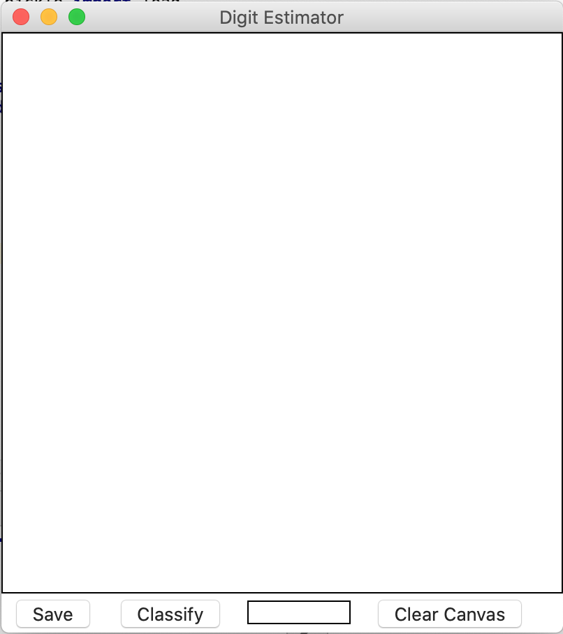
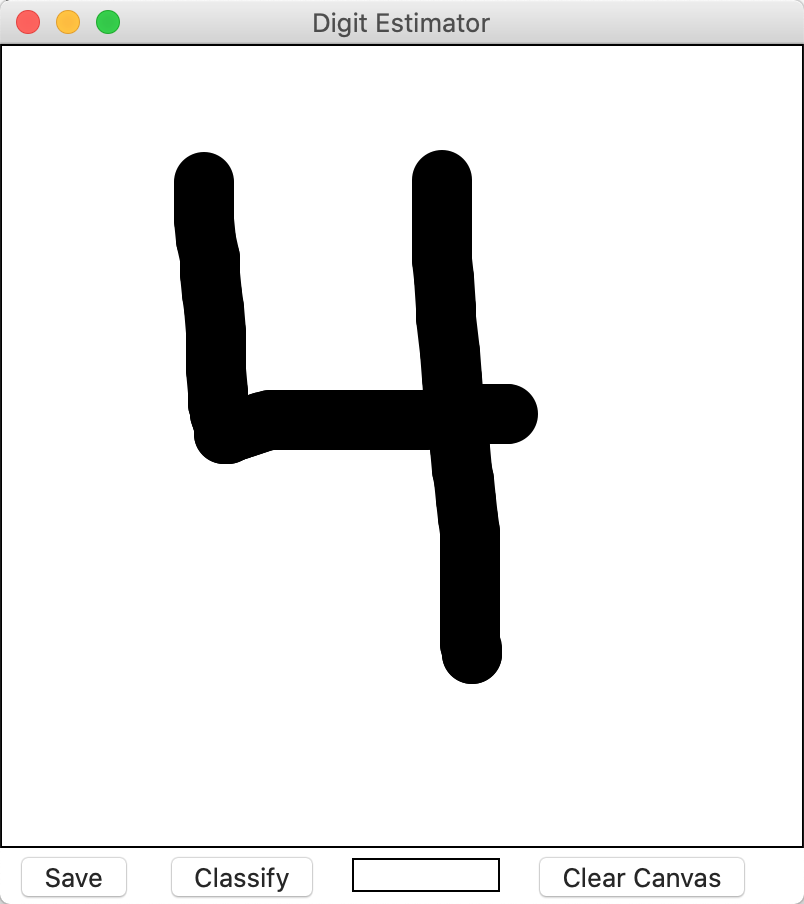
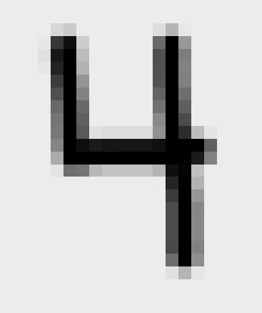
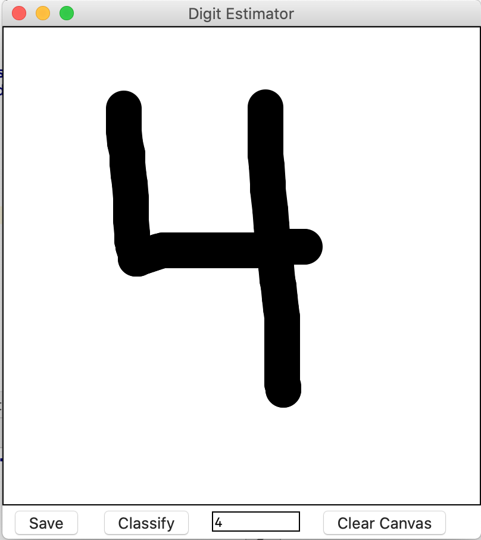

# How it works

When you run the program, the below canvas will appear on the screen. You will able to write anything on it and save the image to your local file as a PNG file. 

You may also write a single digit on the canvas, and press 'Estimate', and the program predict what digit was written on the screen.

You may click 'Save' to simply save the image to your local directory, press 'Clear canvas' to clear the screen and return to a blank state, or you could press 'Estimate' to make the model estimate what digit was written on the Screen.

The Program uses the model.pkl to estimate the digits. This is a support vector classification machine learning model, and it was trained using the [mnist_784 dataset](https://www.openml.org/d/554). Each instance in this dataset is an array of 784 (28 * 28) values between 0-255. 

This SVC model was trained using 80% of the data in this dataset and tested with the other 20%. The mnist_784 dataset contains 70,000 instances so 56,000 instances were used to train the model, and the other 14,000 were used for testing. On these 14,000 instances, the model has a ~98.2 percent accuracy.

When you press 'Estimate' on the screen, the program will automatically save your image as a PNG file to the local directory, and then it will create another PNG image, which is exactly like the original image, but resized to 28*28 pixels like below.

Then the program will feed the data into the model, and then the model will create an estimate, which is shown in the textbox below the canvas.

